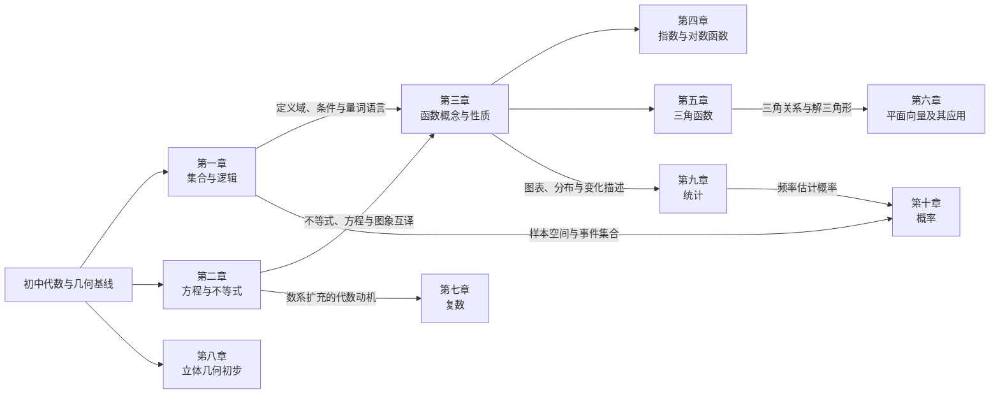

# 高一全年数学知识图谱

> 适用范围：广东惠州、人教 A 版高中数学必修第一册与必修第二册。
>
> 本图谱只组织章、节、最小学习停靠点、长期价值和直接前置，不复制教材正文、例题或习题。范围与编号规则见 [第一批课程范围与知识节点规则](./01-curriculum-scope.md)，事实依据见 [课程范围与资源来源研究](../../research/guangdong-grade10-math-scope-and-sources.md)。

## 读图规则

- `M1-C01…C05` 对应必修第一册第一至五章；`M2-C01…C05` 对应必修第二册第六至十章。`C` 始终表示册内章序，不等同于页面显示的全学年章号。
- 每一条 `定义` 行只定义一个约 5–8 分钟的学习停靠点；节点编号是永久标识。后续覆盖清单引用编号，不另造同义节点。
- 重要度只使用“基础支撑、核心高频、综合应用”。“核心高频”表示位于课程主干，不表示押题概率；“综合应用”明确指出组合对象。
- “直接前置”只列缺失后会直接妨碍理解的节点；`—` 表示这条高中支线的起点，默认学生已具备相应初中基础。前置关系用于提示和补给，不用于锁关。
- 带 `*` 的教材拓展节保留为全年地图分支，但不作为其他必修主干节点的必要前置。

## 全年主干图

这张图只显示全年主干。跨章的精确连接以各节点“直接前置”列和文末“关键跨章连接”表为准。

## 第一章 集合与常用逻辑用语

**册内编号：** `M1-C01`　**章节树：** 1.1 集合的概念 → 1.2 集合间的基本关系 → 1.3 集合的基本运算；1.4 充分条件与必要条件、1.5 全称量词与存在量词形成逻辑语言支线。

| 行类型 | 节点编号 | 节与最小学习停靠点 | 重要度 | 长期价值或组合关系 | 直接前置 |
|---|---|---|---|---|---|
| 定义 | M1-C01-S01-K01 | 1.1 集合与元素：用确定性、互异性和无序性辨认集合 | 基础支撑 | 建立全书对象分类与范围表达的起点。 | —（全年起点） |
| 定义 | M1-C01-S01-K02 | 1.1 元素与集合的关系：正确使用属于、不属于 | 基础支撑 | 防止把元素关系与集合间关系混淆。 | M1-C01-S01-K01 |
| 定义 | M1-C01-S01-K03 | 1.1 集合表示：列举法、描述法与常用数集符号 | 核心高频 | 为解集、定义域、样本空间及事件表示提供统一语言。 | M1-C01-S01-K02 |
| 定义 | M1-C01-S02-K01 | 1.2 子集与真子集：从元素归属判断包含关系 | 基础支撑 | 支撑条件强弱、事件包含和解集比较。 | M1-C01-S01-K03 |
| 定义 | M1-C01-S02-K02 | 1.2 集合相等与空集的边界辨析 | 核心高频 | 集合相等要求元素完全一致，空集是参数讨论的常见边界。 | M1-C01-S02-K01 |
| 定义 | M1-C01-S03-K01 | 1.3 并集与交集：用数轴或图示完成运算 | 核心高频 | 直接服务不等式解集、定义域和事件运算。 | M1-C01-S02-K01 |
| 定义 | M1-C01-S03-K02 | 1.3 补集与全集：识别相对范围后求补 | 核心高频 | 为命题否定和对立事件建立集合表达。 | M1-C01-S03-K01 |
| 定义 | M1-C01-S03-K03 | 1.3 集合运算综合：处理区间端点与参数边界 | 综合应用 | 组合集合关系、并交补与不等式边界，训练分类检验。 | M1-C01-S02-K02，M1-C01-S03-K02 |
| 定义 | M1-C01-S04-K01 | 1.4 条件命题：辨认条件与结论 | 基础支撑 | 为证明、反例和条件关系提供句式框架。 | —（逻辑支线起点） |
| 定义 | M1-C01-S04-K02 | 1.4 充分条件与必要条件：沿正确方向判断推出关系 | 核心高频 | 连接集合包含、方程解集和后续定理条件。 | M1-C01-S04-K01，M1-C01-S02-K01 |
| 定义 | M1-C01-S04-K03 | 1.4 充要条件：验证双向推出 | 核心高频 | 形成定义等价、结论互证与解题条件校验的习惯。 | M1-C01-S04-K02 |
| 定义 | M1-C01-S05-K01 | 1.5 全称量词与存在量词：识别量词及取值范围 | 基础支撑 | 为函数性质表述、命题判断和反例构造提供语言。 | M1-C01-S01-K03，M1-C01-S04-K01 |
| 定义 | M1-C01-S05-K02 | 1.5 含量词命题的否定：改变量词并否定结论 | 核心高频 | 连接补集、反例与概率中的对立事件思想。 | M1-C01-S05-K01，M1-C01-S03-K02 |

## 第二章 一元二次函数、方程和不等式

**册内编号：** `M1-C02`　**章节树：** 2.1 等式性质与不等式性质 → 2.2 基本不等式；2.3 把二次函数图象、一元二次方程的根与一元二次不等式的解集统一起来。

| 行类型 | 节点编号 | 节与最小学习停靠点 | 重要度 | 长期价值或组合关系 | 直接前置 |
|---|---|---|---|---|---|
| 定义 | M1-C02-S01-K01 | 2.1 实数大小与不等关系：用差的正负比较大小 | 基础支撑 | 把“比较大小”转为代数判断，是不等式证明的起点。 | —（代数支线起点） |
| 定义 | M1-C02-S01-K02 | 2.1 等式性质：在等价变形中保持解不变 | 基础支撑 | 支撑方程求解、公式变形和后续恒等变换。 | —（等式变形支线起点） |
| 定义 | M1-C02-S01-K03 | 2.1 不等式性质：加减、同号乘除与传递 | 核心高频 | 是函数单调性、最值、解集变形的通用运算规则。 | M1-C02-S01-K01 |
| 定义 | M1-C02-S01-K04 | 2.1 比较大小与不等式证明：作差、配方和因式分解 | 核心高频 | 把代数变形与符号判断结合，反复用于函数性质。 | M1-C02-S01-K03 |
| 定义 | M1-C02-S02-K01 | 2.2 基本不等式：理解正数条件与等号条件 | 核心高频 | 是求最值和证明不等式的主干工具，条件检查同等重要。 | M1-C02-S01-K04 |
| 定义 | M1-C02-S02-K02 | 2.2 基本不等式求最值：凑定值并校验取等 | 综合应用 | 组合代数变形、定义域和等号条件处理函数最值。 | M1-C02-S02-K01，M1-C01-S03-K03 |
| 定义 | M1-C02-S02-K03 | 2.2 基本不等式的实际最优化 | 综合应用 | 把约束条件翻译为正数模型并检验答案是否符合情境。 | M1-C02-S02-K02 |
| 定义 | M1-C02-S03-K01 | 2.3 二次函数图象：开口、对称轴、顶点与零点 | 核心高频 | 提供函数、方程、不等式三者互译的几何载体。 | M1-C02-S01-K02 |
| 定义 | M1-C02-S03-K02 | 2.3 一元二次方程的根与判别式 | 核心高频 | 用根的个数和位置支撑零点、参数及交点问题。 | M1-C02-S03-K01 |
| 定义 | M1-C02-S03-K03 | 2.3 一元二次不等式：由图象读取解集 | 核心高频 | 把符号变化、区间和端点统一起来。 | M1-C02-S03-K01，M1-C02-S03-K02，M1-C01-S01-K03 |
| 定义 | M1-C02-S03-K04 | 2.3 含参数的二次关系：按开口、根与边界分类 | 综合应用 | 组合判别式、集合边界与分类讨论，是函数综合题的重要准备。 | M1-C02-S03-K02，M1-C02-S03-K03，M1-C01-S03-K03 |

## 第三章 函数的概念与性质

**册内编号：** `M1-C03`　**章节树：** 3.1 函数的概念及其表示 → 3.2 函数的基本性质 → 3.3 幂函数 → 3.4 函数的应用（一）。

| 行类型 | 节点编号 | 节与最小学习停靠点 | 重要度 | 长期价值或组合关系 | 直接前置 |
|---|---|---|---|---|---|
| 定义 | M1-C03-S01-K01 | 3.1 函数概念：从对应关系识别输入、输出与唯一性 | 基础支撑 | 是指数、对数、三角函数和模型学习的共同入口。 | M1-C01-S01-K03 |
| 定义 | M1-C03-S01-K02 | 3.1 定义域：从解析式或情境确定允许输入 | 核心高频 | 连接集合、不等式和所有后续函数运算。 | M1-C03-S01-K01，M1-C02-S01-K03 |
| 定义 | M1-C03-S01-K03 | 3.1 函数值与值域：由对应规则追踪输出范围 | 核心高频 | 支撑最值、方程根和实际模型取值解释。 | M1-C03-S01-K01，M1-C03-S01-K02 |
| 定义 | M1-C03-S01-K04 | 3.1 同一函数判断：比较定义域与对应关系 | 基础支撑 | 防止只凭公式外形判断函数相同。 | M1-C03-S01-K02 |
| 定义 | M1-C03-S01-K05 | 3.1 函数表示：解析式、表格与图象互译 | 核心高频 | 为数形结合、数据阅读和模型选择建立通道。 | M1-C03-S01-K03 |
| 定义 | M1-C03-S01-K06 | 3.1 分段函数：按输入范围选择规则并求值 | 核心高频 | 组合集合边界与多条对应规则，服务实际计费等模型。 | M1-C03-S01-K02，M1-C03-S01-K05 |
| 定义 | M1-C03-S02-K01 | 3.2 单调性：用定义比较同一区间内函数值 | 核心高频 | 是研究函数变化、比较大小和解不等式的核心方法。 | M1-C03-S01-K01，M1-C02-S01-K03 |
| 定义 | M1-C03-S02-K02 | 3.2 单调区间：从图象或解析式辨认变化范围 | 核心高频 | 强调性质属于区间，为复合图象和参数讨论打底。 | M1-C03-S02-K01，M1-C03-S01-K05 |
| 定义 | M1-C03-S02-K03 | 3.2 最大值与最小值：区分局部表现和给定域最值 | 核心高频 | 连接二次函数、基本不等式和实际优化。 | M1-C03-S01-K03，M1-C03-S02-K02 |
| 定义 | M1-C03-S02-K04 | 3.2 奇偶性：按对称定义完成代数判断 | 核心高频 | 把定义域对称、代数关系和图象对称统一起来。 | M1-C03-S01-K02，M1-C03-S01-K05 |
| 定义 | M1-C03-S02-K05 | 3.2 单调性、奇偶性与最值综合 | 综合应用 | 利用对称迁移区间性质，并组合图象求值或解不等式。 | M1-C03-S02-K02，M1-C03-S02-K03，M1-C03-S02-K04 |
| 定义 | M1-C03-S03-K01 | 3.3 幂函数：识别模型及其共同图象特征 | 基础支撑 | 提供用典型函数族研究定义域、单调性和奇偶性的样板。 | M1-C03-S01-K05 |
| 定义 | M1-C03-S03-K02 | 3.3 幂函数性质应用：比较大小与判断变化 | 核心高频 | 把函数性质用于数值比较，并衔接指数函数。 | M1-C03-S03-K01，M1-C03-S02-K01 |
| 定义 | M1-C03-S04-K01 | 3.4 函数模型识别：从变量关系选择适合的表示 | 综合应用 | 组合表格、图象、解析式与情境约束，形成建模入口。 | M1-C03-S01-K05，M1-C03-S01-K06 |
| 定义 | M1-C03-S04-K02 | 3.4 用函数解决实际问题：解释结果并检验范围 | 综合应用 | 贯穿后续增长、周期、统计与概率情境，强调答案回到现实。 | M1-C03-S03-K02，M1-C03-S04-K01 |

## 第四章 指数函数与对数函数

**册内编号：** `M1-C04`　**章节树：** 4.1 指数 → 4.2 指数函数；4.3 对数 → 4.4 对数函数；4.5 函数的应用（二）汇合为零点、近似求解与增长模型。

| 行类型 | 节点编号 | 节与最小学习停靠点 | 重要度 | 长期价值或组合关系 | 直接前置 |
|---|---|---|---|---|---|
| 定义 | M1-C04-S01-K01 | 4.1 根式与 n 次方根：按奇偶性判断存在性和结果 | 基础支撑 | 为分数指数幂的定义与运算边界打底。 | —（指数支线起点） |
| 定义 | M1-C04-S01-K02 | 4.1 分数指数幂：在合法条件下完成根式互化 | 核心高频 | 统一根式与幂的表示，支撑指数函数计算。 | M1-C04-S01-K01 |
| 定义 | M1-C04-S01-K03 | 4.1 实数指数幂及运算性质 | 核心高频 | 把指数运算扩展到实数范围，并连接增长模型。 | M1-C04-S01-K02 |
| 定义 | M1-C04-S02-K01 | 4.2 指数函数概念：识别底数条件与定义域 | 基础支撑 | 建立第一类重要超越函数模型。 | M1-C04-S01-K03，M1-C03-S01-K02 |
| 定义 | M1-C04-S02-K02 | 4.2 指数函数图象：用关键点和底数分类描绘 | 核心高频 | 把参数、图象位置和增减方向关联起来。 | M1-C04-S02-K01，M1-C03-S01-K05 |
| 定义 | M1-C04-S02-K03 | 4.2 指数函数性质：单调性、值域与定点 | 核心高频 | 用统一函数框架完成比较大小和解简单不等式。 | M1-C04-S02-K02，M1-C03-S02-K02 |
| 定义 | M1-C04-S03-K01 | 4.3 对数概念：在指数式与对数式之间互化 | 基础支撑 | 将“求指数”变成可运算的数量，是对数函数入口。 | M1-C04-S01-K03 |
| 定义 | M1-C04-S03-K02 | 4.3 常用对数、自然对数与基本计算 | 基础支撑 | 统一常见记号并支撑数量级和模型计算。 | M1-C04-S03-K01 |
| 定义 | M1-C04-S03-K03 | 4.3 对数运算性质：积、商、幂的对数 | 核心高频 | 把乘除与乘方转化为加减与倍数关系。 | M1-C04-S03-K01，M1-C02-S01-K02 |
| 定义 | M1-C04-S03-K04 | 4.3 换底与对数综合运算 | 核心高频 | 联结不同底数并为比较、方程和模型求解服务。 | M1-C04-S03-K03 |
| 定义 | M1-C04-S04-K01 | 4.4 对数函数概念与定义域 | 基础支撑 | 强化真数为正的边界意识并连接反向指数关系。 | M1-C04-S03-K01，M1-C03-S01-K02 |
| 定义 | M1-C04-S04-K02 | 4.4 对数函数图象：用关键点和底数分类描绘 | 核心高频 | 与指数图象对照，理解增长方向和范围。 | M1-C04-S04-K01，M1-C03-S01-K05 |
| 定义 | M1-C04-S04-K03 | 4.4 对数函数性质：单调性、值域与比较 | 核心高频 | 组合定义域和单调性解决比较与简单不等式。 | M1-C04-S04-K02，M1-C03-S02-K02 |
| 定义 | M1-C04-S04-K04 | 4.4 不同函数增长差异：用图表比较线性、幂、指数、对数增长 | 综合应用 | 为长期趋势判断和模型选择建立尺度意识。 | M1-C03-S03-K01，M1-C04-S02-K03，M1-C04-S04-K03 |
| 定义 | M1-C04-S05-K01 | 4.5 函数零点与方程解：在图象交点和代数方程间互译 | 核心高频 | 统一函数、方程与图象，是后续求根思想的主干。 | M1-C03-S01-K05，M1-C02-S03-K02 |
| 定义 | M1-C04-S05-K02 | 4.5 零点存在判断：用连续变化中的异号信息定位 | 核心高频 | 为二分法和数值近似提供可检验区间。 | M1-C04-S05-K01 |
| 定义 | M1-C04-S05-K03 | 4.5 二分法：迭代缩小零点区间并控制精度 | 综合应用 | 组合函数值符号与近似思想，形成算法意识。 | M1-C04-S05-K02 |
| 定义 | M1-C04-S05-K04 | 4.5 指数、对数函数模型：拟合增长并解释参数 | 综合应用 | 组合函数选择、增长差异和情境检验处理长期变化。 | M1-C03-S04-K02，M1-C04-S04-K04 |

## 第五章 三角函数

**册内编号：** `M1-C05`　**章节树：** 5.1 任意角和弧度制 → 5.2 三角函数概念 → 5.3 诱导公式 → 5.4 图象和性质 → 5.5 三角恒等变换 → 5.6 `y=A sin(ωx+φ)` → 5.7 三角函数应用。

| 行类型 | 节点编号 | 节与最小学习停靠点 | 重要度 | 长期价值或组合关系 | 直接前置 |
|---|---|---|---|---|---|
| 定义 | M1-C05-S01-K01 | 5.1 任意角：用旋转方向和终边表示角 | 基础支撑 | 把初中角推广到周期运动和任意象限。 | —（三角支线起点） |
| 定义 | M1-C05-S01-K02 | 5.1 象限角与终边相同的角 | 核心高频 | 为三角函数符号、周期性和诱导公式定范围。 | M1-C05-S01-K01 |
| 定义 | M1-C05-S01-K03 | 5.1 弧度制：弧长、半径与角度互化 | 核心高频 | 为三角函数自变量、弧长和周期模型提供自然单位。 | M1-C05-S01-K01 |
| 定义 | M1-C05-S02-K01 | 5.2 单位圆中的正弦、余弦和正切定义 | 基础支撑 | 统一任意角三角函数、坐标和向量方向。 | M1-C05-S01-K02，M1-C05-S01-K03 |
| 定义 | M1-C05-S02-K02 | 5.2 三角函数值的符号与特殊角值 | 核心高频 | 支撑诱导公式、图象关键点和解三角形计算。 | M1-C05-S02-K01 |
| 定义 | M1-C05-S02-K03 | 5.2 同角三角函数基本关系 | 核心高频 | 在同一角的正弦、余弦、正切之间建立代数通道。 | M1-C05-S02-K01，M1-C02-S01-K02 |
| 定义 | M1-C05-S03-K01 | 5.3 诱导公式：借助单位圆化归角 | 核心高频 | 用对称与周期把任意角化到熟悉范围。 | M1-C05-S02-K02，M1-C05-S02-K03 |
| 定义 | M1-C05-S04-K01 | 5.4 正弦、余弦函数图象的生成与关键点 | 核心高频 | 把单位圆运动转化为函数图象，是周期模型基础。 | M1-C05-S02-K01，M1-C03-S01-K05 |
| 定义 | M1-C05-S04-K02 | 5.4 正弦、余弦函数的周期性、奇偶性与对称性 | 核心高频 | 组合函数性质和诱导公式压缩研究区间。 | M1-C05-S04-K01，M1-C03-S02-K04 |
| 定义 | M1-C05-S04-K03 | 5.4 正弦、余弦函数的单调区间与最值 | 核心高频 | 支撑比较、求值域和含参周期问题。 | M1-C05-S04-K01，M1-C03-S02-K03 |
| 定义 | M1-C05-S04-K04 | 5.4 正切函数的图象、周期与单调区间 | 核心高频 | 强化定义域断点和周期区间意识。 | M1-C05-S02-K01，M1-C03-S02-K02 |
| 定义 | M1-C05-S05-K01 | 5.5 两角差的余弦公式 | 基础支撑 | 是两角和差公式体系的生成起点。 | M1-C05-S02-K03 |
| 定义 | M1-C05-S05-K02 | 5.5 两角和的余弦公式 | 基础支撑 | 与两角差的余弦共同形成和差公式的生成骨架。 | M1-C05-S05-K01，M1-C05-S02-K03 |
| 定义 | M1-C05-S05-K03 | 5.5 两角和差的正弦公式 | 核心高频 | 将正弦的复杂角拆成已知角，服务求值与化简。 | M1-C05-S05-K01，M1-C05-S05-K02 |
| 定义 | M1-C05-S05-K04 | 5.5 两角和差的正切公式 | 核心高频 | 将正切复合角转为同角函数运算，并检查分母条件。 | M1-C05-S05-K03，M1-C05-S02-K03 |
| 定义 | M1-C05-S05-K05 | 5.5 二倍角的正弦、余弦公式 | 核心高频 | 把二倍角转化为单角关系，支撑降次、求值与图象变换。 | M1-C05-S05-K02，M1-C05-S05-K03 |
| 定义 | M1-C05-S05-K06 | 5.5 简单三角恒等变换：选公式完成化简或求值 | 综合应用 | 组合和差、二倍角与同角关系，训练有目标的公式选择。 | M1-C05-S05-K03，M1-C05-S05-K04，M1-C05-S05-K05 |
| 定义 | M1-C05-S06-K01 | 5.6 参数 A、ω、φ 对正弦型图象的作用 | 核心高频 | 把振幅、周期和相位分别对应到图象变化。 | M1-C05-S04-K01，M1-C03-S01-K05 |
| 定义 | M1-C05-S06-K02 | 5.6 由图象或数据确定正弦型函数 | 综合应用 | 组合关键点、周期、最值与函数表示建立模型。 | M1-C05-S04-K03，M1-C05-S06-K01 |
| 定义 | M1-C05-S07-K01 | 5.7 周期现象建模：确定变量、单位和参数意义 | 综合应用 | 把三角函数连接潮汐、温度或匀速圆周运动等周期情境。 | M1-C03-S04-K02，M1-C05-S06-K02 |
| 定义 | M1-C05-S07-K02 | 5.7 三角模型检验：解释预测并检查周期与取值范围 | 综合应用 | 组合模型、图象性质与情境边界，避免只算不解释。 | M1-C05-S07-K01 |

## 第六章 平面向量及其应用

**册内编号：** `M2-C01`　**章节树：** 6.1 平面向量的概念 → 6.2 平面向量的运算（含数量积）→ 6.3 平面向量基本定理及坐标表示 → 6.4 平面向量的应用（几何与物理中的向量方法、正弦定理、余弦定理与解三角形）。

| 行类型 | 节点编号 | 节与最小学习停靠点 | 重要度 | 长期价值或组合关系 | 直接前置 |
|---|---|---|---|---|---|
| 定义 | M2-C01-S01-K01 | 6.1 向量概念：区分向量与数量，识别模和方向 | 基础支撑 | 建立兼有大小与方向的几何—代数对象。 | —（向量支线起点） |
| 定义 | M2-C01-S01-K02 | 6.1 相等向量、平行向量、零向量与单位向量 | 基础支撑 | 为向量运算、共线和平移表达扫清概念边界。 | M2-C01-S01-K01 |
| 定义 | M2-C01-S02-K01 | 6.2 向量加法：三角形法则与平行四边形法则 | 核心高频 | 把连续位移与合力等情境转成运算。 | M2-C01-S01-K02 |
| 定义 | M2-C01-S02-K02 | 6.2 向量减法：用相反向量或终点差表示 | 核心高频 | 支撑位置向量、几何证明和坐标计算。 | M2-C01-S02-K01 |
| 定义 | M2-C01-S02-K03 | 6.2 向量数乘：大小、方向与运算律 | 核心高频 | 建立线性组合并为共线条件打底。 | M2-C01-S02-K01 |
| 定义 | M2-C01-S02-K04 | 6.2 向量共线条件：用数乘关系判断方向一致 | 核心高频 | 把几何共线转为代数条件。 | M2-C01-S02-K03 |
| 定义 | M2-C01-S02-K05 | 6.2 向量数量积：理解夹角、投影与结果为实数 | 基础支撑 | 建立向量到实数的运算，连接长度、夹角与垂直。 | M2-C01-S01-K01，M1-C05-S02-K01 |
| 定义 | M2-C01-S02-K06 | 6.2 数量积的运算性质及长度、垂直关系 | 核心高频 | 把几何度量和垂直条件转为向量等式。 | M2-C01-S02-K05 |
| 定义 | M2-C01-S03-K01 | 6.3 平面向量基本定理：用不共线基底唯一表示向量 | 核心高频 | 是向量坐标化和线性表示的理论核心。 | M2-C01-S02-K03 |
| 定义 | M2-C01-S03-K02 | 6.3 正交分解与向量坐标表示 | 基础支撑 | 把二维方向分解为两个数，连接平面直角坐标系。 | M2-C01-S03-K01 |
| 定义 | M2-C01-S03-K03 | 6.3 向量加、减、数乘的坐标运算 | 核心高频 | 将几何操作转化为稳定的代数计算。 | M2-C01-S03-K02，M2-C01-S02-K02 |
| 定义 | M2-C01-S03-K04 | 6.3 向量共线的坐标表示 | 核心高频 | 支撑平行、共线和定比分点类问题。 | M2-C01-S02-K04，M2-C01-S03-K03 |
| 定义 | M2-C01-S03-K05 | 6.3 数量积的坐标表示与计算 | 核心高频 | 用坐标统一求模、夹角和判断垂直。 | M2-C01-S02-K06，M2-C01-S03-K03 |
| 定义 | M2-C01-S04-K01 | 6.4 向量方法解决平面几何关系 | 综合应用 | 组合线性运算、共线和数量积完成证明或计算。 | M2-C01-S03-K04，M2-C01-S03-K05 |
| 定义 | M2-C01-S04-K02 | 6.4 正弦定理：由边角对应关系解三角形 | 核心高频 | 连接三角函数值与三角形边角量。 | M1-C05-S02-K02 |
| 定义 | M2-C01-S04-K03 | 6.4 余弦定理：在边角数据间双向求解 | 核心高频 | 把数量积和两角差余弦用于三角形度量。 | M2-C01-S02-K05，M1-C05-S05-K01 |
| 定义 | M2-C01-S04-K04 | 6.4 解三角形的条件选择与多解辨析 | 综合应用 | 组合正弦、余弦定理及三角函数范围判断解的数量。 | M2-C01-S04-K02，M2-C01-S04-K03 |
| 定义 | M2-C01-S04-K05 | 6.4 测量与距离问题中的解三角形建模 | 综合应用 | 把方向、角度、长度和情境约束组织成可检验模型。 | M2-C01-S04-K04，M1-C03-S04-K02 |
| 定义 | M2-C01-S04-K06 | 6.4 向量在物理中的应用：表示力、速度、位移并解释合成或分解结论 | 综合应用 | 把物理量转成向量模型，结合方向与大小解释运算结果而不只计算数值。 | M2-C01-S02-K01，M2-C01-S03-K01 |

## 第七章 复数

**册内编号：** `M2-C02`　**章节树：** 7.1 复数的概念 → 7.2 复数的四则运算；7.3* 复数的三角表示是拓展分支，不作为必修主干前置。

| 行类型 | 节点编号 | 节与最小学习停靠点 | 重要度 | 长期价值或组合关系 | 直接前置 |
|---|---|---|---|---|---|
| 定义 | M2-C02-S01-K01 | 7.1 数系扩充与复数：理解虚数单位和代数形式 | 基础支撑 | 使负数开平方有统一表达，补全代数运算对象。 | M1-C02-S03-K02 |
| 定义 | M2-C02-S01-K02 | 7.1 复数的实部、虚部与相等条件 | 核心高频 | 把复数相等转化为两个实数条件。 | M2-C02-S01-K01 |
| 定义 | M2-C02-S01-K03 | 7.1 复平面、复数对应点与向量 | 基础支撑 | 连接复数代数形式、坐标和向量表示。 | M2-C02-S01-K02，M2-C01-S03-K02 |
| 定义 | M2-C02-S01-K04 | 7.1 共轭复数与复数的模 | 核心高频 | 为除法、距离与几何意义提供工具。 | M2-C02-S01-K03 |
| 定义 | M2-C02-S02-K01 | 7.2 复数加减法及其几何意义 | 核心高频 | 延续向量加减规则并保持实数运算习惯。 | M2-C02-S01-K03，M2-C01-S02-K02 |
| 定义 | M2-C02-S02-K02 | 7.2 复数乘法与虚数单位的幂 | 核心高频 | 支撑复数化简和方程运算。 | M2-C02-S01-K02，M1-C02-S01-K02 |
| 定义 | M2-C02-S02-K03 | 7.2 复数除法：借助共轭完成实数化分母 | 核心高频 | 组合乘法与共轭，形成完整四则运算。 | M2-C02-S01-K04，M2-C02-S02-K02 |
| 定义 | M2-C02-S03-K01 | 7.3* 复数的三角表示：模与辐角的表示思想 | 综合应用 | 连接复平面、向量方向与三角函数；仅作教材拓展，不进入必修依赖链。 | M2-C02-S01-K04，M1-C05-S02-K01 |

## 第八章 立体几何初步

**册内编号：** `M2-C03`　**章节树：** 8.1 基本立体图形 → 8.2 直观图 → 8.3 表面积与体积；8.4 空间点、直线、平面的位置关系 → 8.5 平行 → 8.6 垂直与直线和平面所成角。

| 行类型 | 节点编号 | 节与最小学习停靠点 | 重要度 | 长期价值或组合关系 | 直接前置 |
|---|---|---|---|---|---|
| 定义 | M2-C03-S01-K01 | 8.1 棱柱、棱锥、棱台：从生成与结构特征辨认 | 基础支撑 | 建立多面体分类和要素语言。 | —（空间几何支线起点） |
| 定义 | M2-C03-S01-K02 | 8.1 圆柱、圆锥、圆台与球：从旋转过程辨认 | 基础支撑 | 建立旋转体分类并连接截面与度量。 | —（旋转体支线起点） |
| 定义 | M2-C03-S01-K03 | 8.1 简单组合体：按组成或切割识别结构 | 综合应用 | 把复杂空间对象拆成可描述、可计算的基本几何体。 | M2-C03-S01-K01，M2-C03-S01-K02 |
| 定义 | M2-C03-S02-K01 | 8.2 斜二测画法与空间图形直观图 | 基础支撑 | 把空间对象稳定投影到平面并保留关键关系。 | M2-C03-S01-K03 |
| 定义 | M2-C03-S02-K02 | 8.2 由直观图还原空间关系与截面线索 | 核心高频 | 训练从二维图判断空间位置而不被视觉外观误导。 | M2-C03-S02-K01 |
| 定义 | M2-C03-S03-K01 | 8.3 柱、锥、台的表面积 | 核心高频 | 组合展开、相似关系和基本平面图形面积。 | M2-C03-S01-K03 |
| 定义 | M2-C03-S03-K02 | 8.3 柱、锥、台的体积 | 核心高频 | 为等体积、组合体和实际容量问题提供主干公式。 | M2-C03-S01-K03 |
| 定义 | M2-C03-S03-K03 | 8.3 球的表面积 | 核心高频 | 用半径统一描述球面大小，并为球与其他几何体的组合度量打底。 | M2-C03-S01-K02 |
| 定义 | M2-C03-S03-K04 | 8.3 球的体积 | 核心高频 | 用半径计算球体容量，并与柱、锥体积作数量比较。 | M2-C03-S01-K02 |
| 定义 | M2-C03-S03-K05 | 8.3 简单组合体的表面积与体积 | 综合应用 | 组合球、柱、锥、台的度量并识别重合面、挖空或拼接边界。 | M2-C03-S03-K01，M2-C03-S03-K02，M2-C03-S03-K03，M2-C03-S03-K04 |
| 定义 | M2-C03-S04-K01 | 8.4 平面的基本性质与文字、符号、图形表示 | 基础支撑 | 为所有空间位置关系证明提供公理化语言。 | M2-C03-S02-K02 |
| 定义 | M2-C03-S04-K02 | 8.4 空间两直线的位置关系与异面直线 | 基础支撑 | 区分平行、相交、异面，避免用平面直觉误判。 | M2-C03-S04-K01 |
| 定义 | M2-C03-S04-K03 | 8.4 直线与平面、平面与平面的位置关系 | 基础支撑 | 建立后续平行与垂直判定的分类框架。 | M2-C03-S04-K01 |
| 定义 | M2-C03-S05-K01 | 8.5 空间直线平行的传递与平行公理 | 基础支撑 | 为线面、面面平行的证明搭桥。 | M2-C03-S04-K02 |
| 定义 | M2-C03-S05-K02 | 8.5 直线与平面平行的判定 | 核心高频 | 由平面内一条平行线把线线平行提升为线面平行。 | M2-C03-S04-K03，M2-C03-S05-K01 |
| 定义 | M2-C03-S05-K03 | 8.5 直线与平面平行的性质 | 核心高频 | 借助过该直线的相交平面，把线面平行降为线线平行。 | M2-C03-S05-K02 |
| 定义 | M2-C03-S05-K04 | 8.5 平面与平面平行的判定 | 核心高频 | 由一个平面内两条相交直线控制面面平行。 | M2-C03-S05-K02 |
| 定义 | M2-C03-S05-K05 | 8.5 平面与平面平行的性质 | 核心高频 | 把两个平行平面与第三平面的交线关系转成线线平行。 | M2-C03-S05-K04 |
| 定义 | M2-C03-S06-K01 | 8.6 异面直线所成角与空间直线垂直 | 核心高频 | 把异面方向平移到同一平面中度量。 | M2-C03-S04-K02 |
| 定义 | M2-C03-S06-K02 | 8.6 直线与平面垂直的判定 | 核心高频 | 用平面内两条相交直线控制直线与整平面的垂直。 | M2-C03-S04-K03，M2-C03-S06-K01 |
| 定义 | M2-C03-S06-K03 | 8.6 直线与平面垂直的性质 | 核心高频 | 从线面垂直推出线线垂直或平行，服务关系转化。 | M2-C03-S06-K02 |
| 定义 | M2-C03-S06-K08 | 8.6 直线与平面所成角：由斜线及其射影确定并求角 | 核心高频 | 把空间线面夹角化为平面内锐角，并用线面垂直确定射影。 | M2-C03-S06-K03 |
| 定义 | M2-C03-S06-K04 | 8.6 二面角及其平面角 | 核心高频 | 把两个半平面的张开程度化为空间中可度量的平面角。 | M2-C03-S06-K01 |
| 定义 | M2-C03-S06-K05 | 8.6 平面与平面垂直的判定 | 核心高频 | 由一个平面经过另一个平面的垂线建立面面垂直。 | M2-C03-S06-K02，M2-C03-S06-K04 |
| 定义 | M2-C03-S06-K06 | 8.6 平面与平面垂直的性质 | 核心高频 | 在垂直平面中构造线面垂直，反向提取可用直线。 | M2-C03-S06-K03，M2-C03-S06-K05 |
| 定义 | M2-C03-S06-K07 | 8.6 空间位置与角的综合应用 | 综合应用 | 组合平行、垂直的判定与性质及线面角，完成关系证明或角度计算。 | M2-C03-S05-K05，M2-C03-S06-K06，M2-C03-S06-K08 |

## 第九章 统计

**册内编号：** `M2-C04`　**章节树：** 9.1 随机抽样 → 9.2 用样本估计总体 → 9.3 统计案例；数据来源、抽样代表性和结论边界贯穿全章。

| 行类型 | 节点编号 | 节与最小学习停靠点 | 重要度 | 长期价值或组合关系 | 直接前置 |
|---|---|---|---|---|---|
| 定义 | M2-C04-S01-K01 | 9.1 总体、个体、样本与样本量 | 基础支撑 | 建立“用部分认识整体”的对象语言。 | M1-C01-S01-K03 |
| 定义 | M2-C04-S01-K02 | 9.1 简单随机抽样与随机数方法 | 核心高频 | 用等可能抽取降低选择偏差，并衔接概率。 | M2-C04-S01-K01 |
| 定义 | M2-C04-S01-K03 | 9.1 分层随机抽样与比例分配 | 核心高频 | 面对结构差异明显的总体保持样本代表性。 | M2-C04-S01-K02 |
| 定义 | M2-C04-S01-K04 | 9.1 数据获取途径与数据来源评价 | 综合应用 | 根据研究问题选择调查、实验或公开资料，并检查来源是否匹配目标总体。 | M2-C04-S01-K01 |
| 定义 | M2-C04-S01-K05 | 9.1 抽样误差与抽样偏差辨析 | 综合应用 | 组合抽样方法和来源判断，区分随机波动与系统性失真。 | M2-C04-S01-K02，M2-C04-S01-K03，M2-C04-S01-K04 |
| 定义 | M2-C04-S02-K01 | 9.2 频数、频率与频率分布表 | 基础支撑 | 把原始数据组织成可比较的分布信息。 | M2-C04-S01-K01 |
| 定义 | M2-C04-S02-K02 | 9.2 频率分布直方图及分布形态 | 核心高频 | 用面积表达频率，观察集中、离散和偏斜。 | M2-C04-S02-K01 |
| 定义 | M2-C04-S02-K03 | 9.2 百分位数及其样本估计 | 核心高频 | 描述个体在群体中的相对位置并支撑分层判断。 | M2-C04-S02-K01 |
| 定义 | M2-C04-S02-K04 | 9.2 平均数及其反映的集中趋势 | 核心高频 | 用全部观测值概括中心，并识别极端值对平均数的影响。 | M2-C04-S02-K01 |
| 定义 | M2-C04-S02-K07 | 9.2 中位数及其反映的集中趋势 | 核心高频 | 通过排序定位中心，理解它对极端值较稳健。 | M2-C04-S02-K01 |
| 定义 | M2-C04-S02-K08 | 9.2 众数及其反映的集中趋势 | 基础支撑 | 用出现最频繁的取值描述典型水平，并辨认无众数或多众数。 | M2-C04-S02-K01 |
| 定义 | M2-C04-S02-K09 | 9.2 根据数据分布选择集中趋势量 | 综合应用 | 比较平均数、中位数和众数的适用性，给出与分布特征一致的解释。 | M2-C04-S02-K04，M2-C04-S02-K07，M2-C04-S02-K08 |
| 定义 | M2-C04-S02-K05 | 9.2 极差及其反映的离散程度 | 基础支撑 | 用最大值与最小值的距离快速描述总体波动范围。 | M2-C04-S02-K01 |
| 定义 | M2-C04-S02-K10 | 9.2 方差：由各数据与平均数的偏差平方衡量波动 | 核心高频 | 把每个观测值的偏离汇总为非负指标，支撑样本间稳定性比较。 | M2-C04-S02-K04 |
| 定义 | M2-C04-S02-K11 | 9.2 标准差及其离散程度解释 | 核心高频 | 将方差还原到原数据单位，并结合集中趋势解释波动大小。 | M2-C04-S02-K10 |
| 定义 | M2-C04-S02-K06 | 9.2 用样本数字特征估计总体 | 综合应用 | 组合抽样代表性、位置、中心和离散程度作有边界的推断。 | M2-C04-S01-K05，M2-C04-S02-K03，M2-C04-S02-K09，M2-C04-S02-K11 |
| 定义 | M2-C04-S03-K01 | 9.3 统计案例：提出问题、整理数据、分析并表达结论 | 综合应用 | 串联抽样、图表、数字特征和情境解释形成完整调查链。 | M2-C04-S02-K02，M2-C04-S02-K06 |
| 定义 | M2-C04-S03-K02 | 9.3 统计结论的局限：区分数据证据、推断与因果 | 综合应用 | 防止把相关现象、样本结论或偏差数据夸大为因果事实。 | M2-C04-S01-K05，M2-C04-S03-K01 |

## 第十章 概率

**册内编号：** `M2-C05`　**章节树：** 10.1 随机事件与概率 → 10.2 事件的相互独立性 → 10.3 频率与概率；集合运算是事件语言，统计实验连接经验频率与理论概率。

| 行类型 | 节点编号 | 节与最小学习停靠点 | 重要度 | 长期价值或组合关系 | 直接前置 |
|---|---|---|---|---|---|
| 定义 | M2-C05-S01-K01 | 10.1 随机试验、样本点与有限样本空间 | 基础支撑 | 把随机过程的可能结果组织为集合。 | M1-C01-S01-K03 |
| 定义 | M2-C05-S01-K02 | 10.1 随机事件、必然事件与不可能事件 | 基础支撑 | 建立概率研究对象并区分事件与单个结果。 | M2-C05-S01-K01，M1-C01-S02-K02 |
| 定义 | M2-C05-S01-K03 | 10.1 事件关系与和、积、对立事件运算 | 核心高频 | 将包含、并交补直接用于随机事件表达。 | M2-C05-S01-K02，M1-C01-S03-K02 |
| 定义 | M2-C05-S01-K04 | 10.1 古典概型：判断有限性与等可能性 | 核心高频 | 为基本概率计算提供模型前提，避免机械套公式。 | M2-C05-S01-K01 |
| 定义 | M2-C05-S01-K05 | 10.1 古典概型中的样本点列举与计数 | 核心高频 | 组合集合表示、分类与逐一核对完成概率比值。 | M2-C05-S01-K03，M2-C05-S01-K04 |
| 定义 | M2-C05-S01-K06 | 10.1 概率基本性质与取值范围 | 基础支撑 | 提供概率计算和结果合理性检查的底线。 | M2-C05-S01-K02 |
| 定义 | M2-C05-S01-K07 | 10.1 互斥事件的加法公式 | 核心高频 | 把复杂事件拆成互不重叠部分求概率。 | M2-C05-S01-K03，M2-C05-S01-K06 |
| 定义 | M2-C05-S01-K08 | 10.1 对立事件的概率计算 | 核心高频 | 用样本空间中的补集简化“不发生”或“至少一个”等问题。 | M2-C05-S01-K03，M2-C05-S01-K06 |
| 定义 | M2-C05-S01-K09 | 10.1 两事件和的概率与重叠校正 | 核心高频 | 在事件不互斥时扣除重复部分，避免直接相加。 | M2-C05-S01-K03，M2-C05-S01-K07 |
| 定义 | M2-C05-S02-K01 | 10.2 相互独立事件的含义与判断 | 基础支撑 | 区分独立与互斥，建立多阶段随机过程语言。 | M2-C05-S01-K03，M2-C05-S01-K06 |
| 定义 | M2-C05-S02-K02 | 10.2 独立事件乘法公式 | 核心高频 | 将分阶段同时发生的概率转化为乘法。 | M2-C05-S02-K01 |
| 定义 | M2-C05-S02-K03 | 10.2 多阶段随机试验的概率模型 | 综合应用 | 组合样本空间、事件运算、加法与乘法处理流程问题。 | M2-C05-S01-K05，M2-C05-S01-K09，M2-C05-S02-K02 |
| 定义 | M2-C05-S03-K01 | 10.3 频率的随机波动与稳定趋势 | 核心高频 | 连接重复试验、统计图表和概率的经验解释。 | M2-C04-S02-K01，M2-C05-S01-K06 |
| 定义 | M2-C05-S03-K02 | 10.3 用随机模拟估计概率并评价误差 | 综合应用 | 组合抽样、频率和模型检验，理解估计而非精确替代。 | M2-C05-S03-K01，M2-C04-S01-K05 |

## 关键跨章连接

| 从节点 | 到节点 | 连接用途 |
|---|---|---|
| M1-C01-S01-K03 集合表示 | M1-C03-S01-K02 定义域 | 用集合或区间准确表达允许输入。 |
| M1-C01-S04-K02 充分、必要条件 | M1-C03-S02-K01 单调性 | 区分性质成立的条件、结论和区间范围。 |
| M1-C02-S03-K03 二次不等式 | M1-C03-S02-K02 单调区间 | 将图象的上下与增减信息转成区间判断。 |
| M1-C03-S02-K02 单调区间 | M1-C04-S02-K03 指数函数性质 | 把一般函数研究框架迁移到具体函数族。 |
| M1-C04-S05-K01 零点与方程 | M1-C05-S06-K02 确定正弦型函数 | 用交点、周期与关键点共同反推函数参数。 |
| M1-C05-S02-K01 单位圆定义 | M2-C01-S02-K05 数量积 | 用余弦描述方向夹角并连接投影。 |
| M1-C05-S02-K02 三角函数值 | M2-C01-S04-K02 正弦定理 | 用角的正弦值建立三角形中边与角的对应关系。 |
| M2-C01-S03-K02 向量坐标 | M2-C02-S01-K03 复平面 | 同一对实数分别表示平面向量和复数对应点。 |
| M1-C01-S03-K02 补集 | M2-C05-S01-K08 对立事件 | 事件的“不发生”就是相对样本空间取补。 |
| M1-C03-S01-K05 函数表示 | M2-C04-S02-K02 频率分布直方图 | 迁移表格—图象互译能力，阅读数据分布而不把统计图当作函数图象。 |
| M2-C04-S02-K01 频率分布 | M2-C05-S03-K01 频率稳定趋势 | 从数据的经验频率过渡到概率解释。 |

## 维护与使用说明

1. 后续上学期覆盖清单必须引用本文件 `M1` 节点，不重新命名或分配编号；第二学期首批只引用图谱，不承诺完整题目覆盖。
2. 若学生缺少某个前置，推荐 3–5 分钟补给或回看相邻节点，但仍允许打开当前节点。
3. 若增删节点，先核对册、章、节、学习目标和所有引用，再分配未使用编号；不得回收旧编号。
4. 章节树和节名只作事实性索引；学习目标、价值说明和关系描述均为本项目自有表达。
